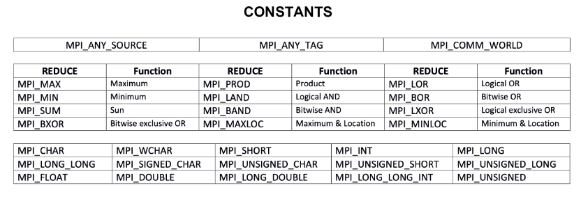

# MPI

## Initialization and Finalization

```c
int MPI_Init(int *argc, char ***argv); // Initialize MPI environment
int MPI_Comm_size(MPI_Comm comm, int *size); // Get total number of processes
int MPI_Comm_rank(MPI_Comm comm, int *rank); // Get rank of calling process
int MPI_Finalize(void); // Clean up MPI environment
int MPI_Barrier(MPI_Comm comm); // Synchronize all processes
```

- `argc`, `argv`: Command-line arguments (like in `main`)
- `comm`: Communicator (usually `MPI_COMM_WORLD`)
- `size`: Output, number of processes
- `rank`: Output, rank (ID) of calling process

---

## Point-to-Point Communication

```c
int MPI_Send(const void *buf, int count, MPI_Datatype datatype,
    int dest, int tag, MPI_Comm comm); // Blocking send
int MPI_Recv(void *buf, int count, MPI_Datatype datatype,
    int source, int tag, MPI_Comm comm, MPI_Status *status); // Blocking receive
int MPI_Sendrecv(const void *sendbuf, int sendcount, MPI_Datatype sendtype,
    int dest, int sendtag, void *recvbuf, int recvcount,
    MPI_Datatype recvtype, int source, int recvtag,
    MPI_Comm comm, MPI_Status *status); // Send and receive in one call
int MPI_Isend(const void *buf, int count, MPI_Datatype datatype,
    int dest, int tag, MPI_Comm comm, MPI_Request *request); // Non-blocking send
int MPI_Irecv(void *buf, int count, MPI_Datatype datatype,
    int source, int tag, MPI_Comm comm, MPI_Request *request); // Non-blocking receive
```

- `buf`, `sendbuf`, `recvbuf`: Data buffer(s)
- `count`, `sendcount`, `recvcount`: Number of elements
- `datatype`, `sendtype`, `recvtype`: Type of data (e.g., `MPI_INT`)
- `dest`, `source`: Destination/source rank
- `tag`, `sendtag`, `recvtag`: Message tag (integer label)
- `status`: Output, info about received message
- `request`: Output, handle for non-blocking operations

---


## Communicators and Groups

```c
int MPI_Comm_create(MPI_Comm comm, MPI_Group group, MPI_Comm *newComm); // Create new communicator
int MPI_Comm_split(MPI_Comm comm, int color, int key, MPI_Comm *newComm); // Split communicator
int MPI_Comm_rank(MPI_Comm comm, int *rank); // Get rank in communicator

int MPI_Comm_group(MPI_Comm comm, MPI_Group *group); // Get group from communicator
int MPI_Group_incl(MPI_Group group, int n, const int ranks[], MPI_Group *new_group); // Include ranks in new group
int MPI_Group_rank(MPI_Group group, int *rank); // Get rank in group
int MPI_Group_size(MPI_Group group, int *size); // Get size of group
```

- `group`, `new_group`: Group of processes
- `color`, `key`: Used to split communicator (color = group, key = rank order)
- `ranks[]`: Array of ranks to include

---

## Datatypes

```c
int MPI_Type_vector(int count, int blocklength, int stride,
    MPI_Datatype oldtype, MPI_Datatype *newtype); // Create vector datatype
int MPI_Type_hvector(int count, int blocklength, MPI_Aint stride,
    MPI_Datatype oldtype, MPI_Datatype *newtype); // Like vector, stride in bytes
int MPI_Type_commit(MPI_Datatype *datatype); // Commit new datatype
int MPI_Type_free(MPI_Datatype *datatype); // Free datatype
```

- `count`: Number of blocks
- `blocklength`: Elements per block
- `stride`: Spacing between blocks (in elements or bytes)
- `oldtype`: Base datatype
- `newtype`: Output, new datatype

---

## Collective Communication

```c
int MPI_Bcast(void *buffer, int count, MPI_Datatype datatype, int root, MPI_Comm comm); // Broadcast
int MPI_Scatter(const void *sendbuf, int sendcount, MPI_Datatype sendtype,
    void *recvbuf, int recvcount, MPI_Datatype recvtype, int root, MPI_Comm comm); // Scatter
int MPI_Gather(const void *sendbuf, int sendcount, MPI_Datatype sendtype,
    void *recvbuf, int recvcount, MPI_Datatype recvtype, int root, MPI_Comm comm); // Gather
int MPI_Allgather(const void *sendbuf, int sendcount, MPI_Datatype sendtype,
    void *recvbuf, int recvcount, MPI_Datatype recvtype, MPI_Comm comm); // Allgather
```

- `buffer`, `sendbuf`, `recvbuf`: Data buffers
- `count`, `sendcount`, `recvcount`: Number of elements
- `datatype`, `sendtype`, `recvtype`: Data type
- `root`: Rank of root process

---

## Collective Calculation

```c
int MPI_Reduce(const void *sendbuf, void *recvbuf, int count,
    MPI_Datatype datatype, MPI_Op op, int root, MPI_Comm comm); // Reduce to root
int MPI_Allreduce(const void *sendbuf, void *recvbuf, int count,
    MPI_Datatype datatype, MPI_Op op, MPI_Comm comm); // Reduce, all get result
int MPI_Scan(const void *sendbuf, void *recvbuf, int count,
    MPI_Datatype datatype, MPI_Op op, MPI_Comm comm); // Prefix reduction
```

- `op`: Operation (e.g., `MPI_SUM`, `MPI_MAX`)
- For `MPI_MAXLOC` and `MPI_MINLOC`, use the predefined datatype `MPI_2INT` and set `count = 1`.

---

## Topology

```c
int MPI_Cart_create(MPI_Comm comm_old, int ndims, int dims[], int periods[],
  int reorder, MPI_Comm *comm_cart); // Create Cartesian topology
int MPI_Comm_rank(MPI_Comm comm, int *rank); // Get rank in communicator
int MPI_Cart_coords(MPI_Comm comm, int rank, int maxdims, int coords[]); // Get coordinates
int MPI_Cart_shift(MPI_Comm comm, int direction, int displacement,  
  int *rank_source, int *rank_dest); // Shift in topology
int MPI_Cart_sub(MPI_Comm comm, int remain_dims[], MPI_Comm *newcomm); // Subgrid communicator
```

- `ndims`: Number of dimensions
- `dims[]`: Array, size of each dimension
- `periods[]`: Array, periodicity (1=true, 0=false)
- `reorder`: Allow rank reordering (1=true, 0=false)
- `coords[]`: Output, coordinates of process
- `direction`: 0=column, 1=row
- `displacement`: Shift amount (+/-). >0 = down/right, <0 = up/left
- `remain_dims[]`: Which dimensions to keep (1=keep, 0=drop)

## Constants



## Other Utils

### File I/O Functions (C Standard Library)

```c
FILE *fopen(const char *path, const char *mode); // Open file
int fscanf(FILE *fp, const char *format, [arguments]) // Read formatted data from file
int fseek(FILE *fp, long offset, int whence); // Move file pointer
int fclose(FILE *fp);  // Close file
```

- `fopen`: Opens a file at `path` with access `mode` (e.g., `"r"`, `"w"`)
- `fscanf`: Reads data from file using `format` (e.g., `"%d"`, `"%f"`)
- `fseek`: Moves file pointer to a new position (`offset` from `whence`, e.g., `SEEK_SET`)
- `fclose`: Closes the file
